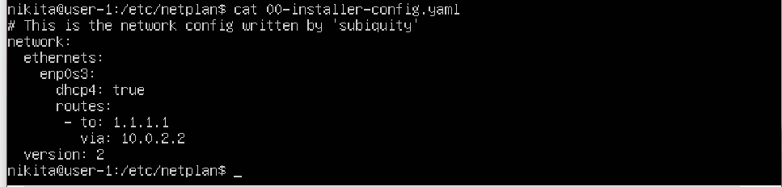
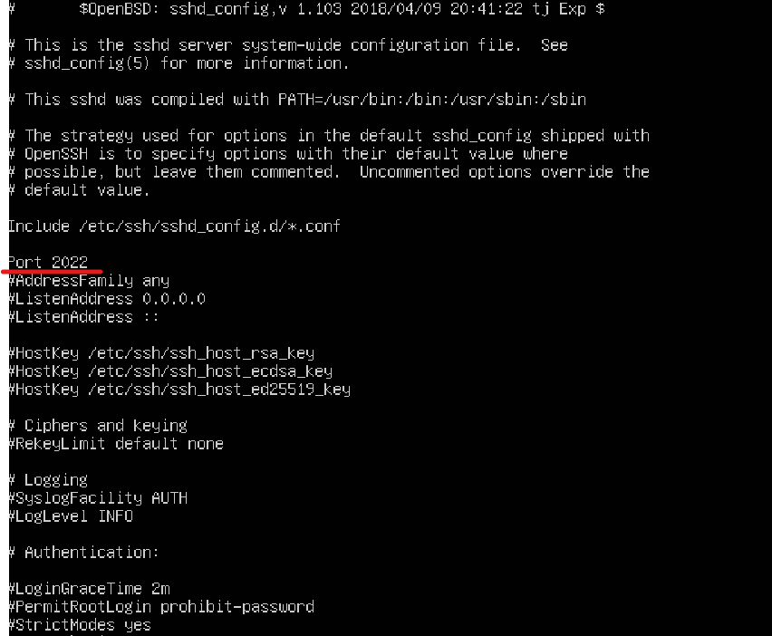

# Report
## UNIX/Linux operating systems (Basic).

1. [Отчет]() \
    1.1 [Установка ОС](#part-1-установка-oc)  
    1.2 [Создание пользователя](#part-2-создание-пользователя)  
    1.3 [Настройка сети ОС](#part-3-настройка-сети-ос)   
    1.4 [Обновление ОС](#part-4-обновление-ос)  
    1.5 [Использование команды  sudo](#part-5-использование-команды-sudo)  
    1.6 [Установка и настройка службы времени](#part-6-установка-и-настройка-службы-времени)  
    1.7 [Установка и использование текстовых редакторов](#part-7-установка-и-использование-текстовых-редакторов)  
    1.8 [Установка и базовая настройка сервиса SSHD](#part-8-установка-и-базовая-настройка-сервиса-sshd)   
    1.9 [Установка и использование утилит top, htop](#part-9-установка-и-использование-утилит-top-htop)   
    1.10 [Использование утилиты fdisk](#part-10-использование-утилиты-fdisk)   
    1.11 [Использование утилиты df](#part-11-использование-утилиты-df)    
    1.12 [Использование утилиты du](#part-12-использование-утилиты-du)    
    1.13 [Установка и использование утилиты ncdu](#part-13-установка-и-использование-утилиты-ncdu)    
    1.14 [Работа с системными журналами](#part-14-работа-с-системными-журналами)     
    1.15 [Использование планировщика заданий CRON](#part-15-использование-планировщика-заданий-cron) 

#

## part-1-установка-oc
-Скачал Server-Ubuntu без GUI

-Вывод команды : `cat /etc/issue`

 

#

## part-2-создание-пользователя

Использовал утилиту useradd. \
На самом деле для просмотра логов была нужна группа adm, группу изменил с помощью утилиты usermod 

#

## part-3-настройка-сети-ос

Установил название машины

Time zone 

-После этого я узнал что можно использовать про протокол NTP и воспользовался им.

sudo timedatectl set-npt no (устанавлеваем флаг в no)

sudo apt update (обновлям apt пакеты)

sudo apt install ntp (устанавлевам ntp)

ntpq -p (активирум протокол)

P.S вот так бывает когда торопишься !

Loopback — это термин, который обычно используется для описания методов или процедур маршрутизации электронных сигналов, цифровых потоков данных, или других движущихся сущностей от их источника и обратно к тому же источнику без специальной обработки или модификаций. Первоначально он использовался для тестирования передачи или передающей инфраструктуры.

DHCP - Dynamic Host Configuration Protocol — протокол динамической настройки узла) — прикладной протокол, позволяющий сетевым устройствам автоматически получать IP-адрес и другие параметры, необходимые для работы в сети TCP/IP. Данный протокол работает по модели «клиент-сервер». Для автоматической конфигурации компьютер-клиент на этапе конфигурации сетевого устройства обращается к так называемому серверу DHCP и получает от него нужные параметры. \

внешний ip-адрес шлюза (ip) и внутренний IP-адрес шлюза

или

- задаем маршрут

- ping 1.1.1.1

- ping ya.ru

## Part 4. Обновление ОС

## Part 5. Использование команды sudo

Команда sudo ( substitute user and do, подменить пользователя и выполнить ) позволяет строго определенным пользователям выполнять указанные программы с административными привилегиями без ввода пароля суперпользователя root.

- изменяем группу пользователя

- изменил hostname

## Part 6. Установка и настройка службы времени

- Время

- timedatectl show

## Part 7. Установка и использование текстовых редакторов

-vim

для сохранения используем :wq

-nano

[Ctrl + O] или
для сохранения при выходе [Crtl + c] указываем y

-mcedit

[F2] или
при выходе указываем сохранение

-vim

при выходе :q!

-nano

для сохранения при выходе [Crtl + c] указываем n

-mcedit

при выходе указываем не сохранять

cat *.txt

-vim

поиск осуществляеться через /фраза 

т.к после поиска используем [c] и заменяем слово

-nano
[Ctrl  W] найти текст 
[Alt W] перейти

[Alt + R] найти и заменить
также можно использовать регулярные выражения (еще раз [Alt + R])

-mcedit
поиск [F7]

поиск и замена [F4]

## Part 8. Установка и базовая настройка сервиса **SSHD**

-установка openssh-server
 

-добавляем в авто загрузку sshd

-Перенастроить службу SSHd на порт 2022
в etc/ssh/sshd_config

-Используя команду ps, показать наличие процесса sshd.\
Флаг -A или -e отображает все процессы.

-t tcp соединение(можно поставить -u UDP)

-a это all

-n вывод ip адресов без опеределени hostname (DNS)

Proto-протокол передачи данных 
Recv-Q и Send-Q - принятые отпраленые данные
Local Address - локальный адрес (в частносте 0.0.0.0 подразумевает использование как lo так и ip)

Foreing Adderss -внешний адрес

Status - состояние соединения. Состояние Listening говорит о том, что строка состояния отображает информацию о сетевой службе, ожидающей входящие соединения по соответствующему протоколу на адрес и порт, отображаемые в колонке "Локальный адрес ". Состояние ESTABLISHED указывает на активное соединение. В колонке "Состояние" для соединений по протоколу TCP может отображаться текущий этап TCP-сессии определяемый по обработке значений флагов в заголовке TCP - пакета (Syn, Ask, Fin ... ). Возможные состояния:

CLOSE_WAIT - ожидание закрытия соединения.\
CLOSED - соединение закрыто.\
ESTABLISHED - соединение установлено.\
LISTENING - ожидается соединение (слушается порт)\
TIME_WAIT - превышение времени ответа.

## Part 9. Установка и использование утилит **top**, **htop**

- По выводу команды top определить и написать в отчёте:
  - uptime = 3:09
  - количество авторизованных пользователей = 1
  - общую загрузку системы = 0,02 , 0,01 , 0,00
  - общее количество процессов  = 102
  - загрузку cpu = 0,0
  - загрузку памяти = 246,5
  - pid процесса занимающего больше всего памяти top
  - pid процесса, занимающего больше всего процессорного времени kwoeker/..

- htop:
  - Сортировка по PID 
  - Сортировка по PERCENT_CPU 
  - Сортировка по PERCENT_MEM 
  - Сортировка по TIME ![TIME] 
  - sshd 
  - syslog 
  - с добавленным выводом hostname, clock и uptime  

## Part 10. Использование утилиты **fdisk**

Disk /dev/sda

SIZE 5GiB

Sector 10485678

Swap 0 

## Part 11. Использование утилиты **df** 

- df В отчёте написать для корневого раздела (/):
  - размер раздела = 4316484
  - размер занятого пространства = 3268953
  - размер свободного пространства = 808896
  - процент использования = 81
  Е.и Kb

- df -Th В отчёте написать для корневого раздела (/):
    - размер раздела = 4,2G
    - размер занятого пространства = 3,2G
    - размер свободного пространства = 720M
    - процент использования = 81
    Type ext4

## Part 12. Использование утилиты **du**

- du -ch /home 

- du -ch /var 

- du -h /var/log 

- du -ch /var 

## Part 13. Установка и использование утилиты **ncdu**

- ncdo /home 

- ncdu  /var 

- du -ch /var/log 

## Part 14. Работа с системными журналами

- authorization 

- sudo systemctl stop/start sshd

- syslog 

## Part 15. Использование планировщика заданий **CRON**

- crontab -l 

- syslog 

- crontab -r (навероне лучше руками через crontab -e)
